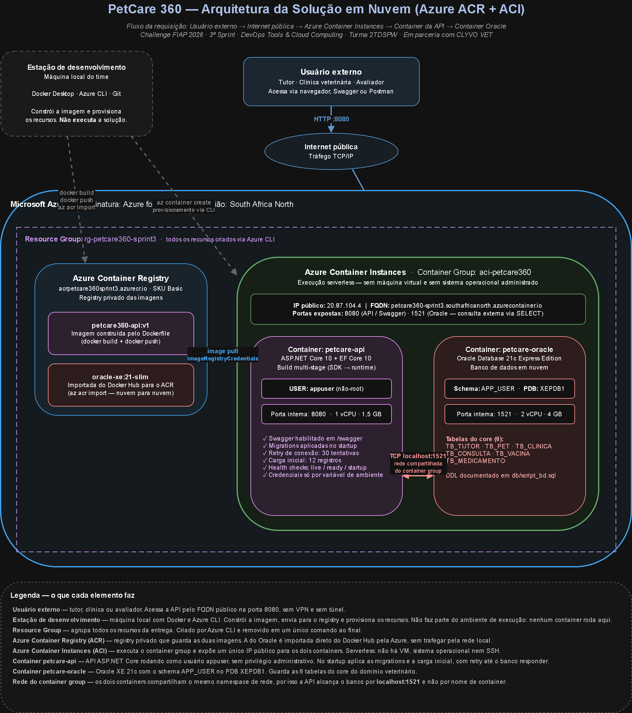

# PetCare 360 — Containerização em Nuvem com ACR + ACI

Entrega da **3ª Sprint** da disciplina **DevOps Tools & Cloud Computing** — Challenge FIAP 2026, em parceria com a **CLYVO VET**.

A solução coloca a API .NET do PetCare 360 e o banco Oracle rodando **inteiramente em containers na nuvem Azure**, com as imagens armazenadas no Azure Container Registry (ACR) e a execução no Azure Container Instances (ACI). Nenhum recurso é criado pelo portal: tudo via Azure CLI.

> **Aplicação no ar durante a banca:**
> `http://petcare360-sprint3.southafricanorth.azurecontainer.io:8080/swagger`

---

## Sumário

- [Descrição da solução](#descrição-da-solução)
- [Benefícios para o negócio](#benefícios-para-o-negócio)
- [Arquitetura](#arquitetura)
- [Estrutura do repositório](#estrutura-do-repositório)
- [Pré-requisitos](#pré-requisitos)
- [Como executar (How To)](#como-executar-how-to)
- [Testando a solução](#testando-a-solução)
- [Consultando o banco diretamente](#consultando-o-banco-diretamente)
- [Comandos Docker utilizados](#comandos-docker-utilizados)
- [Modelo de dados](#modelo-de-dados)
- [Segurança](#segurança)
- [Removendo os recursos](#removendo-os-recursos)
- [O grupo](#o-grupo)

---

## Descrição da solução

O **PetCare 360** nasceu de uma dor concreta: hoje a saúde do animal vive aos pedaços. O tutor perde a carteirinha de vacinação, esquece quando foi a última dose, troca de clínica e o histórico fica para trás. Cada clínica tem o seu sistema, cada veterinário anota do seu jeito, e quem paga o preço é o animal.

Nossa API centraliza **tutor, pet, clínica, consultas, vacinas e medicamentos** em um único lugar. Ela é o núcleo de cadastro do domínio: antes de qualquer informação chegar ao aplicativo do tutor ou ao painel da clínica, ela passa por aqui.

A aplicação expõe **CRUD completo sobre 6 tabelas relacionadas** e rotas de consulta cruzada — como o histórico clínico completo de um animal, ou todas as vacinas aplicadas em um pet específico.

**O foco desta entrega** não é a regra de negócio (essa foi desenvolvida na disciplina de Advanced Business Development with .NET), e sim a **containerização em nuvem**:

- API ASP.NET Core 10 em container Docker, executando como usuário **não-root**
- Banco **Oracle Database 21c Express Edition** em container separado
- Ambas as imagens armazenadas no **Azure Container Registry**
- Execução em **Azure Container Instances**, com IP público e FQDN
- Toda a infraestrutura provisionada por **Azure CLI**

---

## Benefícios para o negócio

**Para o tutor.** Acaba a carteirinha perdida e a vacina vencida sem aviso. O histórico do pet fica acessível de qualquer lugar, mesmo que ele troque de clínica.

**Para a clínica veterinária.** Quando o animal chega para atendimento, o veterinário já tem o histórico inteiro na tela: vacinas anteriores, medicações em curso, diagnósticos passados. Isso reduz o tempo de anamnese e a chance de erro clínico — prescrever algo que conflita com uma medicação em uso, por exemplo.

**Para a CLYVO VET.** Abre caminho para uma rede integrada de clínicas parceiras com dados centralizados. Isso vira inteligência de mercado: padrões regionais de doença, sazonalidade de atendimentos, lacunas de cobertura vacinal.

**Para a operação (foco desta disciplina).** A containerização traz ganhos diretos e mensuráveis:

- **Ambiente reprodutível.** Qualquer pessoa clona o repositório e sobe a solução idêntica — mesma versão do .NET, mesma versão do Oracle, mesmo schema. Acaba o "na minha máquina funciona".
- **Sem servidor para administrar.** O ACI é container serverless: não há sistema operacional para atualizar, nem SSH, nem patch de segurança. Reduz superfície de ataque e custo operacional.
- **Deploy em minutos.** Do `git clone` à aplicação no ar em três comandos. Subir um ambiente de demonstração para um cliente deixa de ser um projeto e vira uma tarefa.
- **Custo sob demanda.** O ACI cobra por segundo de execução. Um ambiente de homologação pode existir só durante a validação e ser destruído em seguida.
- **Resiliência a dependências.** A API implementa retry na conexão com o banco: se o Oracle ainda está inicializando, ela reconecta sozinha em vez de morrer.

---

## Arquitetura



O fluxo completo, do usuário externo até a persistência:

1. O usuário acessa o **FQDN público** do container group na porta 8080.
2. O tráfego chega ao **Azure Container Instances**, que expõe um IP público único para o grupo.
3. O container **petcare-api** recebe a requisição no Kestrel e a processa (Controller → Service → Repository).
4. O repositório consulta o container **petcare-oracle** via `localhost:1521`. Containers do mesmo container group compartilham o namespace de rede — por isso `localhost`, e não nome de container como no Docker Compose.
5. As imagens de ambos os containers são puxadas do **Azure Container Registry** no momento da criação do grupo.

---

## Estrutura do repositório

```
Challenge-Devops-Sprint3/
├── src/                                  # Solution .NET (Clean Architecture)
│   ├── PetCare360.API/                   # Controllers, Program.cs, middleware
│   ├── PetCare360.Application/           # Services (regras de negócio)
│   ├── PetCare360.Domain/                # Entidades e interfaces
│   ├── PetCare360.Infrastructure/        # DbContext, repositórios, migrations
│   ├── PetCare360.UnitTests/
│   └── PetCare360.IntegrationTests/
├── db/
│   └── script_bd.sql                     # DDL comentado das 6 tabelas
├── scripts/
│   ├── 00-variaveis.sh                   # Nomes de recursos e carga do .env
│   ├── 01-criar-acr.sh                   # Resource Group + ACR
│   ├── 02-build-push.sh                  # Build da API + envio das imagens
│   ├── 03-deploy-aci.sh                  # Container group no ACI
│   ├── 99-limpar-tudo.sh                 # Remove todos os recursos
│   └── aci-petcare360.template.yaml      # Template do container group
├── docs/
│   └── arquitetura.png
├── Dockerfile                            # Multi-stage, usuário não-root
├── .dockerignore
├── .env.example                          # Modelo das variáveis de ambiente
└── README.md
```

---

## Pré-requisitos

| Ferramenta | Verificação |
|---|---|
| Git | `git --version` |
| Docker Desktop (aberto) | `docker ps` |
| Azure CLI | `az --version` |
| Assinatura Azure ativa | `az login` |

Na primeira vez em uma assinatura nova, registre os providers:

```bash
az provider register --namespace Microsoft.ContainerInstance
az provider register --namespace Microsoft.ContainerRegistry
```

---

## Como executar (How To)

### 1. Clonar o repositório

```bash
git clone https://github.com/MurilloFernandesCarapia/Challenge-Devops-Sprint3.git
cd Challenge-Devops-Sprint3
```

### 2. Configurar as senhas

Nenhuma senha é versionada. Crie o seu `.env` a partir do modelo:

```bash
cp .env.example .env
```

Edite o `.env` e defina as duas senhas:

```bash
ORACLE_ADMIN_PASSWORD=<senha do administrador do Oracle>
APP_USER_PASSWORD=<senha do usuário da aplicação>
```

> **Regra do Oracle:** a senha não pode começar com número nem conter `@`, `/`, `&` ou aspas.

### 3. Autenticar na Azure

```bash
az login
```

### 4. Criar o Resource Group e o Container Registry

```bash
bash scripts/01-criar-acr.sh
```

Cria o Resource Group `rg-petcare360-sprint3` e o ACR `acrpetcare360sprint3` (SKU Basic), ambos na região `southafricanorth`.

> Para trocar de região ou de nomes, edite apenas `scripts/00-variaveis.sh`. Todos os demais scripts leem dali.

### 5. Buildar e enviar as imagens

```bash
bash scripts/02-build-push.sh
```

Este script:
- autentica o Docker no ACR (`az acr login`);
- builda a imagem da API a partir do `Dockerfile` (`docker build`);
- envia a imagem para o registry (`docker push`);
- importa a imagem do Oracle XE direto do Docker Hub para o ACR (`az acr import`), sem passar pela rede local.

### 6. Subir a solução no ACI

```bash
bash scripts/03-deploy-aci.sh
```

Lê as credenciais do ACR, gera o YAML do container group a partir do template (injetando senhas como `secureValue`) e cria o grupo com `az container create`. Ao final, imprime o FQDN público.

### 7. Acompanhar a inicialização

```bash
source scripts/00-variaveis.sh
az container logs --resource-group $RG_NAME --name $ACI_NAME --container-name petcare-api
```

O Oracle XE leva de **2 a 3 minutos** para ficar disponível. Durante esse tempo a API tenta reconectar a cada 10 segundos, até 30 vezes. É comportamento esperado e você verá a evolução nos logs:

```
Tentativa 1/30  → ORA-50201  (listener ainda não responde)
Tentativa 10/30 → ORA-01017  (listener respondeu, usuário ainda não criado)
Tentativa 11/30 → Banco pronto: migrations aplicadas e carga inicial concluida.
```

---

## Recursos criados via Azure CLI

Todos os recursos desta entrega são provisionados exclusivamente por linha de comando. **Nenhum recurso foi criado pelo portal da Azure.**

| Recurso | Nome | Comando | Script |
|---|---|---|---|
| Resource Group | `rg-petcare360-sprint3` | `az group create` | `01-criar-acr.sh` |
| Container Registry | `acrpetcare360sprint3` | `az acr create` | `01-criar-acr.sh` |
| Imagem da API | `petcare360-api:v1` | `docker build` + `docker push` | `02-build-push.sh` |
| Imagem do Oracle | `oracle-xe:21-slim` | `az acr import` | `02-build-push.sh` |
| Container Group (App + Banco) | `aci-petcare360` | `az container create` | `03-deploy-aci.sh` |
| IP público e FQDN | `petcare360-sprint3` | criado junto do container group | `03-deploy-aci.sh` |

Para conferir o que existe na assinatura a qualquer momento:

```bash
az resource list --resource-group rg-petcare360-sprint3 --output table
```

## Testando a solução

```bash
source scripts/00-variaveis.sh
FQDN=$(az container show --resource-group $RG_NAME --name $ACI_NAME --query "ipAddress.fqdn" -o tsv)
echo $FQDN
```

**Swagger no navegador:**

```
http://<FQDN>:8080/swagger
```

**Health check (readiness — verifica a conexão com o Oracle):**

```bash
curl -i http://$FQDN:8080/health/ready
```

**Consultar registros da carga inicial:**

```bash
curl http://$FQDN:8080/api/Tutores
curl http://$FQDN:8080/api/Pets
```

**Confirmar que o container não roda como root** (requisito 8.2):

```bash
az container exec --resource-group $RG_NAME --name $ACI_NAME \
  --container-name petcare-api --exec-command "whoami"
```

Resposta esperada: `appuser`.

---

## Consultando o banco diretamente

Para evidenciar cada operação de CRUD no banco por `SELECT`, abra um shell no container do Oracle:

```bash
az container exec --resource-group $RG_NAME --name $ACI_NAME \
  --container-name petcare-oracle --exec-command "/bin/bash"
```

Dentro do container:

```bash
sqlplus APP_USER/<senha>@localhost:1521/XEPDB1
```

Consultas úteis:

```sql
SET LINESIZE 200
SET PAGESIZE 100

-- Todas as tabelas do schema
SELECT table_name FROM user_tables ORDER BY table_name;

-- Tutores e pets relacionados
SELECT t.ID_TUTOR, t.NM_TUTOR, p.NM_PET, p.ESPECIE
FROM TB_TUTOR t
LEFT JOIN TB_PET p ON p.ID_TUTOR = t.ID_TUTOR
ORDER BY t.ID_TUTOR;

-- Contagem por tabela
SELECT 'TB_TUTOR' TABELA, COUNT(*) TOTAL FROM TB_TUTOR
UNION ALL SELECT 'TB_PET',          COUNT(*) FROM TB_PET
UNION ALL SELECT 'TB_CLINICA',      COUNT(*) FROM TB_CLINICA
UNION ALL SELECT 'TB_CONSULTA',     COUNT(*) FROM TB_CONSULTA
UNION ALL SELECT 'TB_VACINA',       COUNT(*) FROM TB_VACINA
UNION ALL SELECT 'TB_MEDICAMENTO',  COUNT(*) FROM TB_MEDICAMENTO;
```

A porta 1521 também está exposta no IP público, permitindo conexão por SQL Developer ou DBeaver usando o FQDN como host e `XEPDB1` como service name.

---

## Comandos Docker utilizados

Os scripts automatizam os comandos abaixo. Para executá-los manualmente:

```bash
# Autenticar no registry
az acr login --name acrpetcare360sprint3

# Buildar a imagem da API (contexto = raiz do repositório)
docker build -t acrpetcare360sprint3.azurecr.io/petcare360-api:v1 .

# Enviar para o ACR
docker push acrpetcare360sprint3.azurecr.io/petcare360-api:v1

# Importar a imagem do Oracle para o ACR (nuvem para nuvem)
az acr import --name acrpetcare360sprint3 \
  --source docker.io/gvenzl/oracle-xe:21-slim \
  --image oracle-xe:21-slim

# Listar as imagens no registry
az acr repository list --name acrpetcare360sprint3 --output table
```

### Executando localmente (opcional, para desenvolvimento)

```bash
docker network create petcare-net

docker run -d --name petcare-oracle --network petcare-net -p 1521:1521 \
  -e ORACLE_PASSWORD=<senha admin> \
  -e APP_USER=APP_USER \
  -e APP_USER_PASSWORD=<senha app> \
  gvenzl/oracle-xe:21-slim

docker build -t petcare360-api:v1 .

docker run -d --name petcare-api --network petcare-net -p 8080:8080 \
  -e "ConnectionStrings__OracleConnection=User Id=APP_USER;Password=<senha app>;Data Source=petcare-oracle:1521/XEPDB1;" \
  petcare360-api:v1
```

> Localmente os containers se resolvem **por nome** (`petcare-oracle`). No ACI eles compartilham a rede do grupo e se resolvem por **`localhost`**.

---

## Modelo de dados

O DDL completo, com comentários em todas as tabelas e colunas, está em [`db/script_bd.sql`](db/script_bd.sql). Em execução, as tabelas são criadas automaticamente pelas migrations do Entity Framework Core.

```
TB_TUTOR (1) ──────┐
                   │ N
                   ▼
TB_PET (1) ──┬──→ TB_CONSULTA (N) ←── (1) TB_CLINICA
             │           │
             ├──→ TB_VACINA (N) ←─────┘
             │
             └──→ TB_MEDICAMENTO (N)
```

Todas as tabelas são **core do domínio veterinário**. Não há tabelas auxiliares de cadastro de cidade, estado ou controle de acesso.

**Regras de integridade:**
- Excluir um pet remove seu histórico clínico em cascata
- Tutor com pets vinculados não pode ser excluído
- Clínica com histórico de consultas não pode ser excluída
- CPF e e-mail do tutor são únicos; CNPJ da clínica também

**Carga inicial:** 12 registros (2 por tabela), aplicados de forma idempotente na primeira subida.

---

## Segurança

- **Container não-root.** A API roda como o usuário `appuser`, criado no Dockerfile. Nenhum privilégio administrativo.
- **Sem credenciais no código.** O `appsettings.json` tem a connection string vazia; o valor real chega por variável de ambiente. O `.env` e o YAML gerado estão no `.gitignore`.
- **Senhas como `secureValue`.** No YAML do ACI, senhas e connection string usam `secureValue`, que a Azure não expõe em `az container show` nem no portal.
- **Template versionado, YAML gerado ignorado.** O repositório contém apenas `aci-petcare360.template.yaml`, com placeholders. O arquivo real é gerado em tempo de deploy.
- **Imagem enxuta.** Build multi-stage: o SDK do .NET fica no estágio de build e não vai para a imagem final.

---

## Removendo os recursos

```bash
bash scripts/99-limpar-tudo.sh
```

Pede confirmação e remove o Resource Group inteiro — ACR, imagens, container group e IP público. Confirme com:

```bash
az group show --name rg-petcare360-sprint3
```

O retorno esperado após a remoção é `ResourceGroupNotFound`.

## O grupo

**Turma 2TDSPW** — Análise e Desenvolvimento de Sistemas

| Nome | RM |
|---|---|
| Murillo Fernandes Carapia | RM564969 |
| Kauan Vieira de Lima | RM565403 |
| João Vitor Lacerda | RM565565 |


